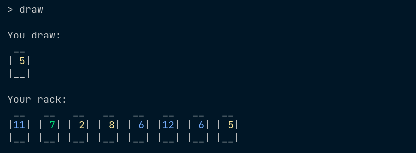
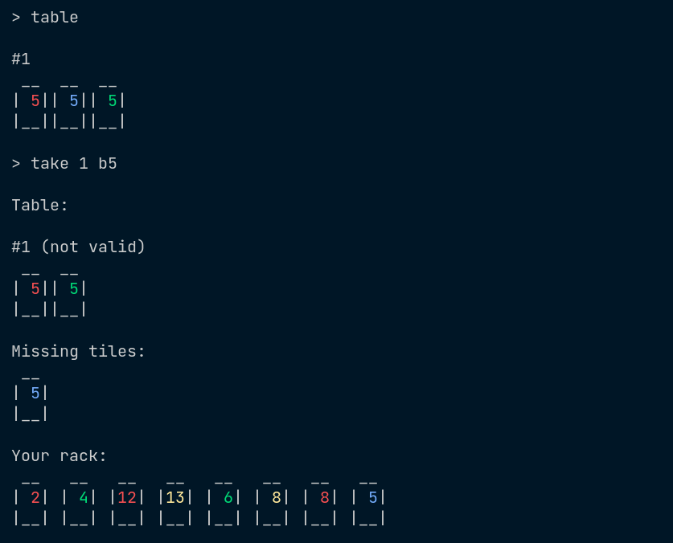

# About
A terminal version of the Rummikub game created for a university course. You are matched with 1-3 bots and are supposed to beat them by issuing commands corresponding to valid moves in Rummikub. The main differences between my implementation and the original game:
* there are no jokers
* the game ends when there are no tiles in the pool (normally it continues until none of the players can make a valid move)

# Commands
Tiles are referenced by their ids. An id consists of the first letter of a color (r, g, b, y) followed by a number (1 - 13). If you have two tiles with the same id on your rack, you can reference the second one by adding '2' before its id, e.g. `2r10`.
* `rack`  
Display all tiles present on your rack.
* `group <tiles>`  
Visually group tiles on your rack.

* `ungroup <tiles>`  
Delete a group consisting of tiles with the given ids.
* `table`  
Display the table state.
* `draw`  
Draw a tile from the pool.

* `put <tiles>`  
Put a valid sequence of tiles onto the table.

* `add <sequence> <tiles>`  
Add tiles from your rack to the given table sequence.

* `take <sequence> <tiles>`  
Take tiles from the given table sequence.

* `split <sequence> <tile>`  
Split a sequence into two sequences such that the second one starts with the given tile.

* `join <sequence> <sequence>`  
Join two sequences (if it is possible).

* `end`  
End your turn.
* `save <filename>`  
Save the state of the game to a file.
* `quit`  
Quit the game.

# Requirements
1. Java
2. Apache Maven
3. a terminal emulator having a width of at least 80 characters and supporting 16 ANSI colors

# Building and launching

```
git clone https://github.com/TWolczanski/terminal-rummikub.git
cd terminal-rummikub/
mvn install
mvn exec:java -Dexec.mainClass=rummikub.Main
```